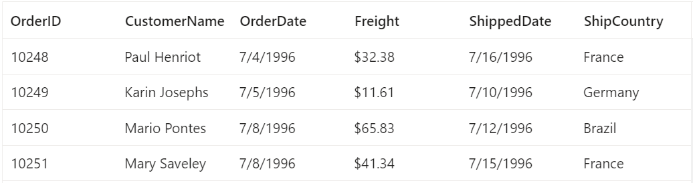

# Getting started with the Syncfusion Grid component in the Streamlit application

This article provides a step-by-step guide for setting up a [Streamlit](https://streamlit.io/) application with a Python environment and integrating the Syncfusion Grid components.

`Streamlit` is a free and open-source framework that enables quick development and sharing of visually appealing web applications for machine learning and data science.

## Setting up the Streamlit application

A recommended approach for beginning with the Streamlit framework is to create a Python environment with [venv](https://docs.python.org/3/library/venv.html). Follow these steps to create a new Python environment.

```bash
python -m venv my-app
```

Using the above command will create a Python virtual environment.

Upon completing the aforementioned step to create **my-app**, run the following command to install Streamlit:

```bash
cd my-app
pip install streamlit
```

Now that **my-app** is ready to run with default settings, let's add Syncfusion Grid components to the application.

## Add the Syncfusion Grid package

The Syncfusion Grid component package is available at [pypi.org](https://pypi.org/project/ej2-streamlit-grids/). To use the Syncfusion Grid component in the application, install the corresponding pip package.

```sh
pip install ej2-streamlit-grids
```

## Import Syncfusion CSS styles

You can import themes for the Syncfusion Streamlit component, such as using CSS or SASS styles from the CDN. Refer to the [themes topic](https://ej2.syncfusion.com/react/documentation/appearance/theme/) to learn more about built-in themes.

In this article, the `Fluent` theme is applied using `theme` property, which are available in CDN. The necessary `Fluent` CSS styles for the Grid component were passed into the `theme` property, which is referenced using the code snippet below.

```py
props.theme = 'https://cdn.syncfusion.com/ej2/22.1.34/fluent.css'
```

## Add the Syncfusion Grid component

Follow the below steps to add the Syncfusion Grid component to the Streamlit Python project:

1\. First, create a Python file named **demo.py** and import the Grid component into the  **demo.py** file.

```py
from ej2_streamlit_grids import GridComponent, GridProps
```

2\. Create and Define the values for the Grid component in the **dataset.csv** file.

```sh
OrderID, CustomerName, OrderDate, Freight, ShippedDate, ShipCountry
10248, Paul Henriot, 7/4/1996, $32.38, 7/16/1996, France
10249, Karin Josephs, 7/5/1996, $11.61, 7/10/1996, Germany
10250, Mario Pontes, 7/8/1996, $65.83, 7/12/1996, Brazil
10251, Mary Saveley, 7/8/1996, $41.34, 7/15/1996, France
```

3\. Define the properties for the Grid component with the `GridProps` class and Pass the `data` read from the `CSV` file as the parameter.

```py
data = pd.read_csv('dataset.csv')
props = GridProps(data)

GridComponent(props)
```

## Run the application

Here is the summarized code for the above steps in the **demo.py** file:

```py
from ej2_streamlit_grids import GridComponent, GridProps
import pandas as pd

data = pd.read_csv('dataset.csv')
props = GridProps(data)
props.theme = 'https://cdn.syncfusion.com/ej2/22.1.34/fluent.css'

GridComponent(props)
```

Ensure that terminal is in the correct project directory where "demo.py" is located. Run the application using the following command:

```sh
streamlit run demo.py
```

The output will appear as follows:



## Grid features demo

The Grid component is rendered along with some additional features in the **demo.py** file located in the **demos** folder. The resulting output with these features will be displayed as depicted below:

