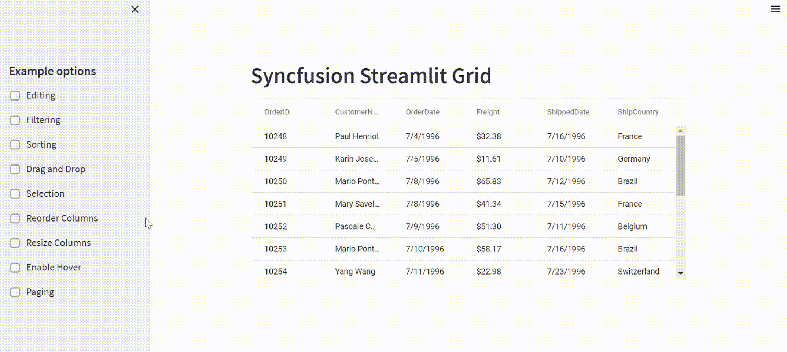

# Getting started with Syncfusion Grid component in Streamlit application

Developers can write `JavaScript` and `HTML components` that can be rendered in Streamlit apps. Streamlit Components can receive data from, and also send data to, Streamlit Python scripts.

Streamlit Components let you expand the functionality provided in the base Streamlit package. Use Streamlit Components to create the needed functionality for your use-case, then wrap it up in a Python package and share with the broader Streamlit community!

The Syncfusion Grid component is a remarkable front-end tool that can be seamlessly integrated into the Streamlit framework, offering users access to a wealth of advanced features and capabilities. For details, refer [here](https://www.syncfusion.com/react-components/react-data-grid).

## Installation

Use the following command to install the Syncfusion Streamlit Grid component.

```sh
pip install ej2-streamlit-grids
```

## Implementation

Create a simple demo.py file as follows:

```py
from ej2_streamlit_grids import GridComponent, GridProps
import pandas as pd

data = pd.read_csv('dataset.csv')
props = GridProps(data)

GridComponent(props)
```

Use the following command to run the application:

```sh
streamlit run demo.py
```

## Demo

The Grid sample is showcased below with few feature.



## Support

Product support is available for through following mediums.

* Creating incident in Syncfusion [Direct-Trac](https://www.syncfusion.com/support/directtrac/incidents/?utm_source=npm&utm_medium=listing&utm_campaign=javascript-layout-npm) support system or [Community forum](https://www.syncfusion.com/forums/essential-js2/?utm_source=npm&utm_medium=listing&utm_campaign=javascript-layout-npm).
* New [GitHub issue](https://github.com/syncfusion/ej2-javascript-ui-controls/issues/new/?utm_source=npm&utm_medium=listing&utm_campaign=javascript-layout-npm).
* Ask your query in [Stack Overflow](https://stackoverflow.com/?utm_source=npm&utm_medium=listing&utm_campaign=javascript-layout-npm) with tag `syncfusion` and `ej2`.

## License

Check the license detail [here](https://github.com/syncfusion/ej2-javascript-ui-controls/blob/master/license/?utm_source=npm&utm_medium=listing&utm_campaign=javascript-layout-npm).

## Changelog

Check the changelog [here](https://github.com/syncfusion/ej2-javascript-ui-controls/blob/master/controls/layouts/CHANGELOG.md/?utm_source=npm&utm_medium=listing&utm_campaign=javascript-layout-npm).

Copyright © 2001 - 2023 Syncfusion Inc. All Rights Reserved. The Syncfusion Essential Studio license and copyright applies to this distribution.
